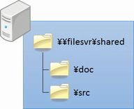
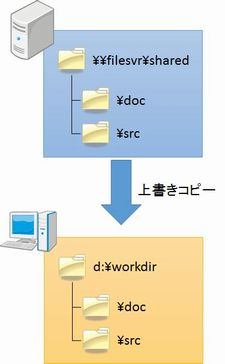
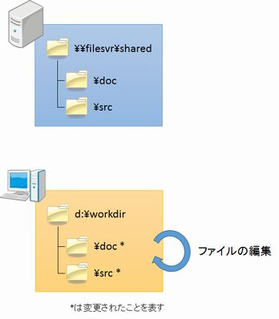
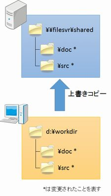

# VCSのない世界

VCSについて学ぶ前に、VCSのない世界ではどんなことが起こるのか、ちょっと覗いてみましょう。

## ある日・・・

あなたはとあるシステム会社で開発を行うプログラマーです。今関わっている案件は小さなプロジェクトということもあり、少人数で開発を行っているため、ファイルサーバーの共有フォルダーで成果物を管理していました。

図1 共有フォルダー

あなたは、今日もいつものように開発を行おうと作業を始めました。

### 1. 作業対象ファイルの取得

まずは作業対象となるドキュメント、ソースコードを共有フォルダーからコピーしなければなりません。あなたが昨日帰った後、他の誰かが作業しているかもしれないからです。

あなたはいつものように、PCの作業フォルダーに、共有フォルダーの内容一式を上書きコピーしました。

図2 作業対象ファイルの取得

### 2. ファイルの編集

作業対象ファイルをコピーしたので、あなたは作業に入ります。ドキュメントを編集し、ソースコードを合わせて編集し、ビルドして結果を確認する、こういった作業を繰り返します。

図3 ファイルの編集

### 3. 作業結果の反映

気が付くとそろそろ業務時間が終わります。あなたはとりあえずここまでの作業結果をメンバーと共有するために、作業フォルダーを丸ごとファイルサーバーに上書きコピーしました。

図4 作業結果の反映

あなたは今日の仕事の充実感に浸りながら、帰路につきました。