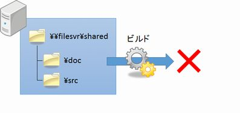

# VCSのない世界

VCSについて学ぶ前に、VCSのない世界ではどんなことが起こるのか、ちょっと覗いてみましょう。

## ある日・・・

あなたはとあるシステム会社で開発を行うプログラマーです。今関わっている案件は小さなプロジェクトということもあり、少人数で開発を行っているため、ファイルサーバーの共有フォルダーで成果物を管理していました。

図1-1 共有フォルダー

あなたは、今日もいつものように開発を行おうと作業を始めました。

### 1. 作業対象ファイルの取得

まずは作業対象となるドキュメント、ソースコードを共有フォルダーからコピーしなければなりません。あなたが昨日帰った後、他の誰かが作業しているかもしれないからです。

あなたはいつものように、PCの作業フォルダーに、共有フォルダーの内容一式を上書きコピーしました。

図1-2 作業対象ファイルの取得

### 2. ファイルの編集

作業対象ファイルをコピーしたので、あなたは作業に入ります。ドキュメントを編集し、ソースコードを合わせて編集し、ビルドして結果を確認する、こういった作業を繰り返します。

図1-3 ファイルの編集

### 3. 作業結果の反映

気が付くとそろそろ業務時間が終わります。あなたはとりあえずここまでの作業結果をメンバーと共有するために、作業フォルダーを丸ごとファイルサーバーに上書きコピーしました。

図1-4 作業結果の反映

あなたは今日の仕事の充実感に浸りながら、帰路につきました。

## 明くる朝

次の日あなたが出社すると、何やらプロジェクトメンバーが揉めています。話を聞くと、システムをテストしようと思ったら、上手く動かなくなっていたと言うことです。

図1-5 テスト環境破壊

あなたは早速メンバーと協力して、障害の原因を調べ始めました。しかし、なかなか原因がつかめません。

そして調査すること数時間、ようやく原因を見つけました。それはなんと、あなたが昨日編集したファイルが原因でした。同じファイルを他のメンバーも編集していたことに気付かずに、そのまま上書きコピーしてしまっていたことが原因でした。

あなたとメンバーは、各自のPCに残ったファイルを元に、修復と変更箇所の統合を行いました。しかし対象となるファイルの数が多く、その作業は深夜まで及び、ようやくシステムがテストできるようになりました。

## 何が問題だったのか？

以上のような出来事は、共有フォルダーで成果物を管理する限り、大なり小なり必ず起こります。その原因を詳しく見ていきましょう。

### 1. 作業対象ファイルの取得

まず、共有フォルダーから作業対象ファイルを取得する際の問題を見ていきましょう。

#### (1) 本当に「最新」なのか？

共有フォルダーであるということは、他の開発メンバーも常に変更が可能です。つまり、「最新」と思っているものが実はコピー途中であるといった可能性が否定できない
のです。

#### (2) 特定の「バージョン」を取得できない

共有フォルダーは常にもっとも後に変更されたものしか管理できません。したがって、「一昨日変更したファイルを元に変更したい」といったケースに対応できません。

### 2. ファイルの編集

ファイルを編集する際の問題点は次の通りです。

#### (1) どのファイルを変更したのかわかりにくい

変更したファイルを簡単に特定する方法が無いため、変更後の共有フォルダーへの反映時に、漏れる可能性があります。

#### (2) 元に戻せない

何らかの失敗や、変更のやり直し、試行錯誤段階など、変更を無かったことにしたいケースが開発の中ではよくあります。しかし、共有フォルダーからコピーするやり方では、再度コピーするしか方法がありません。

#### (3) 作業対象の「バージョン」が一定しない

上記の元に戻す際、共有フォルダーから再度コピーすると、最初にコピーしたときと作業対象のファイルの「バージョン」が変わってしまいます（この作業対象のファイルの「バージョン」を、作業ベースと呼びます）。

### 3. 作業結果の反映

作業結果を共有フォルダーに反映するときも、落とし穴があります。

#### (1) 他の人が同時に変更している可能性

自分が編集したファイルを他の人が同時に変更している可能性が常にあります。この時は「後勝ち」となるため、先に共有フォルダーにアップした人の変更分が、失われてしまいます。

#### (2) 誤操作で削除する可能性

共有フォルダーは、誤操作で簡単にファイルを消すことができます。

#### (3) 環境を壊す可能性

(1)、(2)にも関連しますが、開発中の成果物が不正な状態になることで、簡単に環境が壊れてしまい、テストが不可能になってしまいます。

## では、どうするのか？

人間は間違う生き物です。これらの問題は「気を付ける」レベルで対処できるものではありません。

では、どうするのか？

そこで登場するのがVCSです。人間が間違いやすいところを、ツールでサポートすることにより、システム開発を円滑に進めることができます。

では、次の章でVCSの特徴を学んでいきましょう。