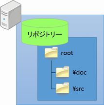
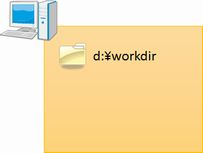
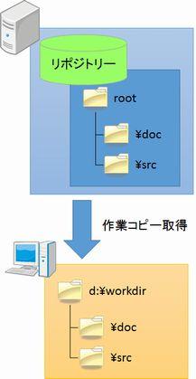
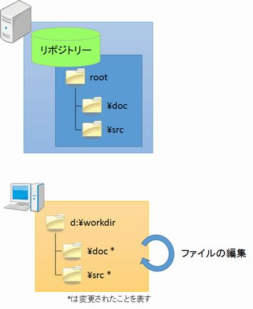
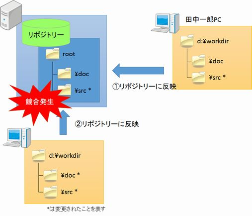
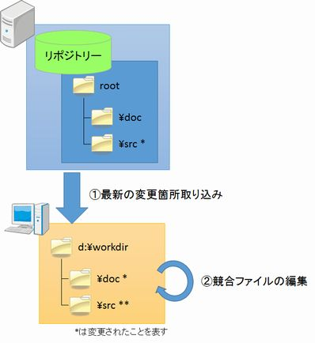
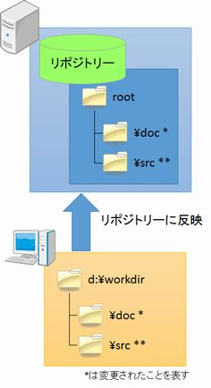

# VCSのある世界

さて、VCSが無いことで痛い目を見た開発プロジェクトが、その後VCSを導入した世界をまた覗いてみましょう。

## 後日
あなたの開発チームは先日の反省を踏まえ、VCSを導入することになり、サーバーにリポジトリーが用意されました。

図3-1 リポジトリー

あなたはまず、作業を行う準備として、PC内に作業フォルダーを作成しました。

図3-2 作業フォルダー作成

次に作業対象のファイルの作業コピーを、リポジトリーから取得しました。

図3-3 作業コピー取得

あなたは、幾つかの作業コピーのドキュメントやソースを変更し、動作を確認しました。

図3-4 作業コピー編集

作業を終えたので、作業コピーの変更をリポジトリーに反映しようとしました。すると、競合が発生したため、反映処理に失敗しました。

図3-5 競合発生

発生した競合についてVCSを使って調べてみました。すると、田中一郎さんが先にリポジトリーに反映した変更と競合していることが分かりました。

あなたは早速田中一郎さんと相談し、田中一郎さんの編集した部分を残しつつ、自分の変更を競合したファイルに反映しました。

図3-6 競合ファイルの編集

競合が亡くなったところで、改めてリポジトリーに変更を反映して無事作業を終えました。

図3-7 リポジトリーに反映

## VCSでハッピーに

これまでシミュレーションしてきた話は、いささか恣意的な例であることは否定しません。

しかし、実際の開発現場ではもっと構造が複雑で、対象となるファイルも多く、メンバーも多数であることがほとんどです。こういった環境では、共有フォルダーでの管理は、事実上不可能であるといっても過言ではありません。

そういった複雑な環境でもVCSというツールを使うことで、自分も他のメンバーも、安心して作業を進めることができます。こういった連携を行うためにも、VCSは不可欠なものなのです。

----------

