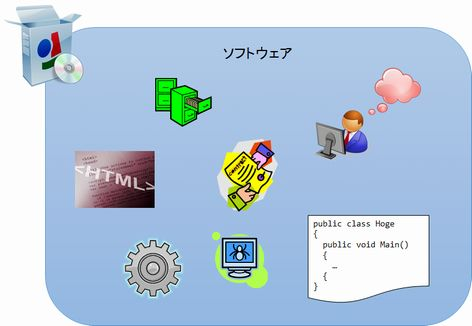

[↑目次](readme.md "目次") | [← 4章 VCSのみでの限界](4.end-of-world-with-only-vcs.md "VCSのみでの限界")

# SCMという智慧

VCSという「ツール」を導入しても、そこに「ルール」が加わらなければ意味がないと言いました。ここでの「ルール」とは何なのか、もう少し詳しく考えてみましょう。

## 何がしたいのか？

ここで最初に立ち戻り、VCSを導入することで何がしたかったのか、考えてみることにしましょう。

VCSがない状態では、次の問題がありました。

- 作業履歴が残らない
- 他の人と作業がぶつかる

また、VCSを導入した後、ルールが無ければこんな問題がありました。

- 履歴から目的の変更を探せない
- 履歴の一つが、どういったきっかけで変更されたかわからない

以上の問題から、VCSを使って行いたかった事とは、

- 各バージョンを識別したい
- 特定のバージョンを再現したい
- 何故変更が行われたのか知りたい
- 他の人と連携して作業を行いたい

ともいえると思います。

これらを実現するための考え方が「SCM（Software Configuration Management、ソフトウェア構成管理）」です。

## 「構成」とは

いきなりSCMと言われても何のことかわからないと思います。そんな時は、問題を小さくしていきましょう。

- Software : ソフトウェア
- Configuration : 構成
- Management : 管理

ですので、そのまま読めば「ソフトウェアの構成を管理する」となります。「ソフトウェア」と「管理」は良いとしても、「構成」とは何のことでしょうか？

「構成」を辞書で引くと、次のように説明されています。

> こうせい 0 【構成】
>
> （名）スル
>
> 1. いくつかの要素を組み立てて一つのまとまりあるものにすること。また、その組み立て。
> 「社会を―する一員」
>
> 1. 〔哲〕〔construction〕経験によらずに概念・形式・イメージなどを操作することで対象を組み立てること。
>
> \- [構成とは - 三省堂 大辞林 Weblio辞書](http://www.weblio.jp/content/構成) より -

つまり、「ソフトウェア構成」とは「ソフトウェアというまとまりがどのような要素の組み合わせでできているか」となります。

図5-1 ソフトウェア構成

## ソフトウェアを構成する「要素」

では、ソフトウェアがどのような「要素」から成り立っているのか考えてみると、

- ソースコード
- コンパイラー
- ライブラリ
- ランタイム

といったものが出てきます。もう一歩踏み込んで、ソフトウェアの振る舞いがどこから出てきたかを考えると、

- 設計書
- バグ管理表
- QA票

といったドキュメント類まで範囲に入ります。さらに踏み込むと、その「要素」の大本は、「こうしたい」、「こうであってほしい」という

- 依頼

もまた、ソフトウェアを構成する要素と考えることができます。

図5-1 ソフトウェアを構成する要素

## どう管理するのか

では、構成を管理するとはどういうことかを、そもそもの目的から導くと、次のようになります。

**ある時点でのソフトウェアを構成する要素すべてを、識別、再現、追跡出来るようメンバー間で成果物を共有し、連携を促すための仕組み、ルール、プロセスを構築し、運用する**

このためには、最低限その変更がどのような「依頼」によるものなのかを、それぞれの要素に紐付け、その組み合わせの履歴を残していかなければなりません。

そのために、VCSをどのように活用すればよいのか次の章で説明していきましょう。

[→ 6章 SCMを意識したVCS利用](6.dance-with-scm.md "SCMを意識したVCS利用")

----------

