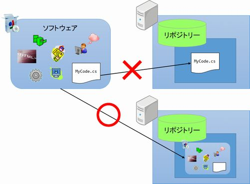
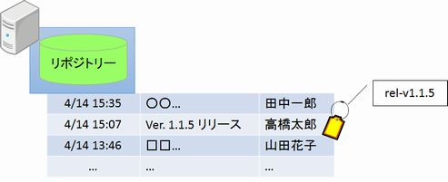

[↑目次](readme.md "目次") | [← 5章 SCMという智慧](5.wisdom-of-scm.md "SCMという智慧")

# SCMを意識したVCS利用

SCMの目的が分かったところで、その考えをどのようにVCS利用方法に取り入れていくか、考えていきましょう。

## VCSの活用法

SCMでやりたいことを今一度まとめると、仕様変更、バグなどをトリガーとした「変更依頼」で発生した、ソフトウェア構成の変更履歴について、

- 識別
- 参照
- 再現

が出来なくてはなりません。

このことから、VCSを使う際には次のことを意識する必要があります。

1. ソースコード以外も管理する
1. 履歴を識別するメタデータを付加する
1. 「タグ」を活用する

### 1. ソースコード以外も管理する

VCSに対するよくある誤解の一つが「ソースコードのバージョン管理を行うツール」というものです。ですが、前の章で述べたように「ソースコード」はソフトウェアを構成する要素のほんの一部でしかありません。ソースコードだけ履歴を残しても、ソフトウェアを再現することはできないのです。

したがって、原則としてソースコードの他に設定ファイルや設計書などのドキュメント類も、VCSで管理する必要があります。

図6-1 VCS管理対象

### 2. 履歴を識別するメタデータを付加する

ソースコード以外の履歴を管理するようにしたとして、今度はその履歴をどうやって「識別」するのかを考えなければいけません。4章で紹介した

- 「どのように」ではなく、その作業を「何故」「何を」「何のために」行うかをメッセージに残す

という使い方を心がけても、どんな変更が行われたかはわかりますが、それがどういった「変更依頼」を元に行われたかはわかりません。

この問題を解決するには、まずVCSとは別のところで「変更依頼」が管理されていることが前提として必要になります。それは例えば、Excelなどで作られた「バグ票」、「QA票」、「仕様変更依頼書」などのドキュメント類があるでしょう。

こういったドキュメントには、その名前とともに識別するための「番号」などが、大体付いています。この情報を利用しない手はありません。

つまりどうするかというと、履歴のメッセージに「文書名-文書番号」といった「メタデータ」を埋め込んでしまうのです。このルールがメンバーで共有できてさえいれば、この「メタデータ」で変更履歴を識別することができるようになります。

<table>
  <tr>
    <td>4/14 10:35</td>
    <td>
      バグ管理票-XX001 
      ○○が××になっていたため、△△に修正する。
    </td>
    <td>高橋太郎</td>
  </tr>
  <tr>
    <td>4/13 17:45</td>
    <td>
      QA管理表-1 

      ○○については××とするよう変更する。
    </td>
    <td>田中一郎</td>
  </tr>
  <tr>
    <td>...</td>
    <td>...</td>
    <td>...</td>
  </tr>
</table>

図6-2 メタデータを付加した履歴

### 3. 「タグ」を活用する

VCSには「タグ」という、特定のバージョンを識別するためのマークを付ける機能があります。

この機能を使って、製品のリリースなどの重要なタイミングに「タグ」を付けることで、検索するまでもなくバージョンを識別することができるようになります。

図6-3 リリースバージョンへのタグ付け

## 必要なのはルール、プロセス

上記のVCS利用方法は、事前に「どこまでをVCSで管理する」、「変更依頼は必ず文書に残す」といったような、ルール、プロセスを定め、運用されているのが前提です。これらができていなければ、そもそも管理などできないからです。

もし、あなたがいる組織でこのようなルール、プロセスが無いようなら、積極的にそのルール、プロセスを定めるように働きかけてみてください。

## VCSだけではできないこともある

ここまで、SCMを意識したVCSの使い方を説明してきましたが、メッセージに文書番号を入れるなど、まだ運用に頼っている部分も多いです。

また、ソフトウェアを構成する要素の内、ソースコードから成果物を作る部分や、その成果物のテスト、関係者への通知など、VCSだけではどうにもならない部分もあります。

こういったものにどう対処すれば良いかというと、「VCS以外のツールに頼る」が正解です。

所詮VCSは「バージョンを管理するだけ」の機能しか持ち合わせていません。苦手な部分は他のツールに任せてしまいましょう。

次の章で、そういったツールのごく一部と活用イメージを紹介します。

[→ 7章 SCMの次のステップ](7.road-to-scm.md "SCMの次のステップ")

----------

