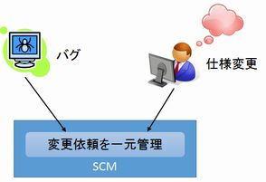
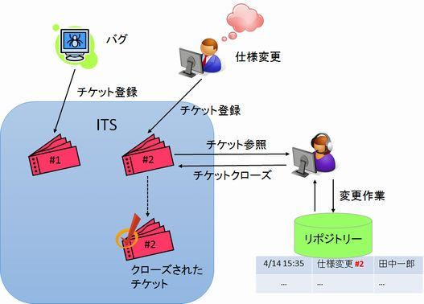
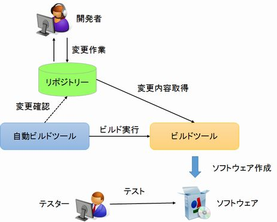
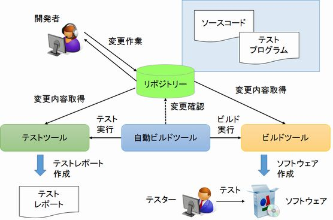

[↑目次](readme.md "目次") | [← 6章 SCMを意識したVCS利用](6.dance-with-scm.md "SCMを意識したVCS利用")

# SCMの次のステップ

VCSだけではサポートできない部分がSCMにはあると説明してきました。では、どんな部分があり、どういったツールでサポートできるのか、その一部を紹介していきましょう。

## 変更依頼の管理

SCMは「変更依頼」の管理も含めてSCMである、と説明してきました。主な変更依頼のトリガーとしては、「バグ」、「仕様変更」等があります。

こういったものは、多くの組織ではそれぞれ「バグ管理票」、「QA票」などで管理されていると思います。しかし、もともとはそれぞれが別文書であるということもあり、「どこからきてどこへ行くのか」追跡がしにくいという問題があります。

このケースへの対応としては、変更依頼のトリガーとなる事象を一元管理する必要があります。ただ、その数は膨大で、とても手書やExcelシートで管理できるものではありません。

図7-1 変更依頼の一元管理

そこで、変更依頼を管理するためのツールの出番です。こういったツールは一般的に「ITS（Issue Tracking System、課題管理システム）」と呼ばれます。

ITSでは、Issue（課題）を「Ticket（チケット）」という単位で登録します。このチケットには一意となる番号（チケット番号）が振られ、担当者を割り当てたり、関連する内容をコメントしたりする機能があり、課題を完了したらチケットを「閉じる（クローズ）」決まりになっています。

これにより、今残っている課題、終わった課題、誰が担当しているかなどが明確になり、管理が容易になります。

また、ITSにはVCSと連携する機能があり、チケット番号をメッセージに入れてそのチケットに関連する履歴を参照したり、完了したことを表すメッセージを入れると自動的にチケットをクローズしたり、といったことが可能になります。

こういった機能を活用することで、その変更が何を起点に誰が作業し、今終わっているのかどうか、そして作業履歴がどうなっているかを、一気通貫で追跡できるようになります。

図7-2 チケットのライフサイクル

ただし、これはあくまでツールを正しく活用できた場合であり、どのような粒度でチケットを作成するかや、どうやって膨大なチケットを管理するかといった課題もあります。これらの問題は、導入した組織で試行錯誤を繰り返し、徐々に洗練させていくしかないでしょう。

## 動くソフトウェアの作成

ソフトウェアは動いてこそです。しかし、ソフトウェアを動作させるには、ソースコードからのコンパイル、実行環境への配置、環境設定など、様々な作業が必要です。この一連の作業を「ビルド」と呼びます。

VCSの仕事はバージョン管理です。したがって、そのバージョンに対応した成果物としての「動くソフトウェア」を作ることは出来ません。代わりに成果物を作る役割を担ってくれるのが「ビルドツール」です。

ビルドツールにはプラットフォーム毎に色々種類があり、それぞれの専用の構文で書かれた「ビルドスクリプト」を実行することで、ビルド作業を行います。

また、VCSと連携してリポジトリに変更が反映されたタイミングや、決められたスケジュールでビルドツールの実行を行うツールもあり、これらは「自動ビルドツール」と呼ばれます。

このビルドツール、自動ビルドツールを活用することで、VCSの履歴に対応したバージョンの動くソフトウェアを、随時作成することができます。これにより、テストを行う際、今動かしているソフトウェアのバージョンが何であり、どんな変更が加えられたものかを追跡することが可能になります。

図7-3 ビルドプロセスイメージ

## 成果物のテストの管理

変更依頼を受け、作業を終え、成果物ができても、今度はその成果物をテストしないといけません。もちろん変更依頼により、テストすべき内容も一緒に変わります。

この時、テスト設計書を修正してリポジトリに反映し、テスターはそのテスト設計書
を元にテストを行い、結果を記入する、といったやり方が、これまでの一般的な方法でした。しかし、変化するスピードも速い昨今の開発では、このサイクルが追い付かない場合もあります。

そんな時に使えるのが「テストツール」です。テストツールを使うと、ソフトウェアのテストをテスト用のプログラムを使って行うことができます。

このテスト用のプログラムも、リポジトリに登録することで、変更依頼に対するテストを一緒に管理できます。
ただし、テストツールによるテストでは、GUI（グラフィック ユーザーインターフェース）に関するテストはコストが高いため、あまり向いていません（不可能ではありません）。

また、自動ビルドツールにより、ビルドのタイミングでテストを行わせる行うことができます。このことを「自動化テスト」と呼びます。

自動化テストを利用し、テストツールで行えるテストはツールに任せ、テスターはGUIなど人の手によるテストに集中することで、テストの負担が軽くなります。

図7-4 自動化テストイメージ

## 他にも・・・

SCMをサポートするために、ソフトウェアの品質を測るために、様々なメトリクス（コード行数、複雑度、etc...）、コードの品質（適切な命名、バグを誘う記述の有無、etc...）、パフォーマンステストなど、様々なことを行ってくれるツールがあります。これらを自動ビルド、ITSと組み合わせることで、SCMで扱う範囲がどんどん広がります。

また、ITSを顧客や上位組織と共有して課題の進捗状況などを共有することで、よりスムーズな連携を促すこともできます。

こういったプロセスの運用、管理も含めてSCMであることを忘れないでください。

## 最後に

VCSが無いとどうなるかから始まり、何ができてどのような問題を解決するか、そして一歩進んだSCMという考えをどうVCSと連携させていくかについて説明してきました。

VCSは所詮ツールです。使える局面は限られますし、ちゃんと使わなければその有効性も発揮できません。ぜひ、ツールの背景にある概念、想定された使い方を理解し、開発を円滑に進められるよう、メンバーと話し合い、共有してみてください。

本文書があなたの開発を進める手助けに、ほんの少しでもなれば幸いです。

[→ 付録 : 参考文献](A.reference.md "付録 : 参考文献")

----------

